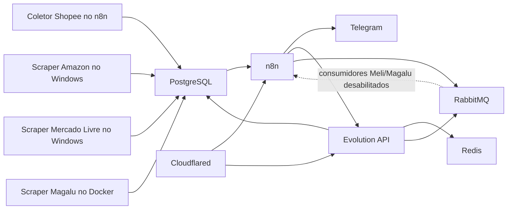
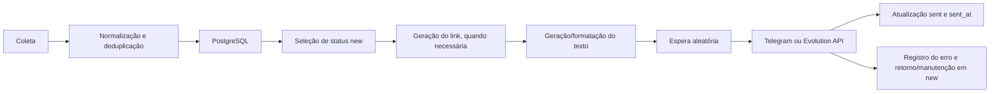

# Inventário do sistema atual — Tá de Graça?

> Inventário somente leitura — 2026-08-06  
> Escopo: repositório local, metadados dos containers, esquema do PostgreSQL, Agendador de Tarefas do Windows e definições do n8n disponibilizadas por `n8n_local`.

Legenda:

- **Confirmado:** observado diretamente em código, configuração ou estado local.
- **Inferência:** conclusão baseada em mais de uma evidência, explicitamente identificada.
- **Lacuna:** não foi possível confirmar sem executar componentes ou acessar sistemas externos.

## 1. Visão geral

### Serviços e componentes

| Componente | Papel | Execução | Dependências |
|---|---|---|---|
| PostgreSQL | Persistência das ofertas e dados de n8n/Evolution | Docker | Volume `postgres_data`; migrations montadas como init scripts |
| n8n | Coleta Shopee, seleção de ofertas, geração de texto, publicação e atualização de status | Docker | PostgreSQL; Redis; RabbitMQ em parte dos fluxos; Telegram, OpenAI e Evolution API |
| Redis | Cache/estado da Evolution API | Docker | Volume `evolution_redis` |
| RabbitMQ | Fila intermediária dos fluxos WhatsApp de Mercado Livre e Magalu | Docker | Volume `rabbitmq_data`; consumidores n8n atualmente desabilitados |
| Evolution API | Envio de mensagens para WhatsApp | Docker | PostgreSQL, Redis e RabbitMQ |
| Cloudflared | Publicação dos endpoints n8n/Evolution por túnel | Docker | n8n e Evolution API |
| Scraper Magalu | Coleta periódica das ofertas da loja afiliada | Docker | PostgreSQL; Chromium/Playwright; diretório de sessão |
| Scraper Amazon | Coleta das páginas Amazon e geração de link afiliado via sessão SiteStripe | Fora do Docker, em Python/Windows | PostgreSQL; Playwright; sessão persistente; Agendador de Tarefas |
| Scraper Mercado Livre | Coleta de ofertas e geração de links no Linkbuilder | Fora do Docker, em Python/Windows | PostgreSQL; Playwright; sessão persistente; Agendador de Tarefas |
| Coletor Shopee | Consulta da API de afiliados e persistência das ofertas | Dentro do n8n | API Shopee; PostgreSQL |
| Telegram | Canal de publicação | Externo | Credenciais administradas pelo n8n |
| OpenAI | Geração dos textos promocionais | Externo | Credencial administrada pelo n8n |

### Dependências principais



### Estado operacional observado

- Os sete serviços do Compose estavam em execução.
- Apenas o PostgreSQL possuía health check configurado e estava saudável.
- O scraper Magalu apresentava ciclo de reinicialização, com 57 reinícios observados.
- **Confirmado:** os logs do Magalu apresentam falhas de Chromium/QEMU.
- **Inferência forte:** a falha decorre da imagem ARM64 sendo executada por emulação em host x86-64.
- As tarefas Windows de Amazon e Mercado Livre estavam habilitadas, mas seus últimos códigos de resultado eram não zero.
- Os fluxos Shopee e Amazon de publicação estavam efetivamente agendados no n8n.
- Os fluxos Telegram de Magalu e Mercado Livre estavam ativos como workflows, mas sem trigger de produção habilitado.
- Os consumidores RabbitMQ/WhatsApp de Magalu e Mercado Livre estavam desabilitados.

## 2. Estrutura de arquivos

Diretórios gerados, ambientes virtuais, dependências instaladas, caches, sessões, cookies, logs, screenshots, HTML de depuração, mídia e backups foram omitidos.

```text
.
├── docker-compose.yml
├── .env
├── .env.example
├── .env.scripts
├── .env.scripts.example
├── backup-and-start-services.ps1
├── check-and-fix-volumes.ps1
├── check-health.ps1
├── manage-services.ps1
├── quick-start.ps1
│
├── docker/
│   └── images/
│       └── n8n-custom/
│           └── Dockerfile
│
├── supabase/
│   └── migrations/
│       └── create_amazon_offers_table.sql
│
├── python_scraper_amazon/
│   ├── scraper.py
│   ├── db_manager.py
│   ├── capture_session.py
│   ├── check_columns.py
│   ├── test_price_capture.py
│   ├── config.yml
│   ├── requirements.txt
│   ├── .env.example
│   ├── README.md
│   └── SETUP.md
│
├── python_scraper_meli/
│   ├── main.py
│   ├── scraper.py
│   ├── db_manager.py
│   ├── capture_session.py
│   ├── process_cleanup.py
│   ├── api_production.py
│   ├── telegram_notifier.py
│   ├── test_link_generator.py
│   ├── config.yml
│   ├── requirements.txt
│   └── .env.example
│
├── python_scraper_magalu/
│   ├── __init__.py
│   ├── main.py
│   ├── scraper.py
│   ├── db_manager.py
│   ├── session_manager.py
│   ├── process_cleanup.py
│   ├── config.yml
│   ├── requirements.txt
│   ├── Dockerfile
│   ├── run_loop.sh
│   ├── README.md
│   └── .env.example
│
├── workflows/
│   └── ta-de-graca/
│       ├── SISTEMA_ALERTAS_IMPLEMENTADO.md
│       ├── shopee/
│       │   ├── GET API Shopee.json
│       │   ├── Shopee Promotions Processor.json
│       │   ├── Shopee - Gerar Short Links.json
│       │   ├── Shopee Log Consolidado.json
│       │   ├── DOCUMENTACAO_SHORTLINKS.md
│       │   ├── database/
│       │   │   └── add_short_link_column.sql
│       │   ├── doc/
│       │   │   └── API Shopee.md
│       │   ├── fix_extract.js
│       │   ├── fix_mutation.js
│       │   └── fix_response_access.js
│       ├── amazon/
│       │   └── arquivos JSON de publicação Telegram/WhatsApp
│       ├── meli/
│       │   ├── GET Meli Offers - API Local.json
│       │   ├── Meli Promotions Processor.json
│       │   └── docs/
│       │       ├── README.md
│       │       ├── README-INDEX.md
│       │       ├── QUICK-START-GUIDE.md
│       │       ├── EXECUTION-CHECKLIST.md
│       │       ├── EXECUTIVE-SUMMARY.md
│       │       ├── ONE-PAGE-SUMMARY.md
│       │       ├── TECHNICAL-DOCS.md
│       │       ├── SAFE-REBUILD-PLAN.md
│       │       ├── MIGRATION-LOG.md
│       │       ├── 2FA-SOLUTION.md
│       │       └── GUIA-COMPLETO-2FA.md
│       └── magalu/
│           ├── GET Offers Magalu.json
│           └── Magalu Promotions Processor.json
│
├── meli_login/
│   └── scripts JavaScript legados de login e sessão
│
└── docs/
    ├── ATUALIZACAO_N8N.md
    ├── CONFIGURACAO_MCP.md
    └── TROUBLESHOOTING_MCP.md
```

Observações:

- Não foi encontrado Dockerfile para Amazon ou Mercado Livre.
- Não foi encontrado um migration versionado completo para `shopee_offers`, `mercado_livre_offers` ou `magalu_offers`.
- Existe migration para adicionar `short_link` à Shopee, mas a coluna não estava presente no esquema ativo.
- `api_production.py` e `telegram_notifier.py`, no Mercado Livre, são stubs.
- `test_link_generator.py` referencia um módulo `link_generator` que não foi encontrado.

## 3. Banco de dados

O esquema ativo foi consultado somente por operações de leitura. Foram encontradas quatro tabelas de ofertas. Nenhuma delas possui chave estrangeira.

Nos SQLs abaixo, uma coluna sem `NOT NULL` é anulável. Elementos administrativos do dump, como ownership e ACL, foram omitidos.

### 3.1 `amazon_offers`

Finalidade: armazenar ofertas Amazon, dados comerciais, link afiliado e estados de publicação.

```sql
CREATE TABLE public.amazon_offers (
    id integer NOT NULL
        DEFAULT nextval('public.amazon_offers_id_seq'::regclass),
    product_name character varying(512) NOT NULL,
    original_url text NOT NULL,
    affiliate_url text,
    image_url text,
    asin character varying(20),
    list_price numeric(10,2),
    sale_price numeric(10,2),
    discount_percentage integer,
    has_coupon boolean DEFAULT false,
    coupon_code character varying(100),
    coupon_discount numeric(10,2),
    promotion_text character varying(255),
    prime_eligible boolean DEFAULT false,
    shipping_info character varying(255),
    rating numeric(2,1),
    review_count integer,
    category character varying(255),
    source_url text,
    scrape_type character varying(50) DEFAULT 'product',
    status_telegram character varying(20) DEFAULT 'new',
    sent_at_telegram timestamp with time zone,
    error_status_telegram character varying(255),
    error_at_telegram timestamp with time zone,
    status_whatsapp character varying(20) DEFAULT 'new',
    sent_at_whatsapp timestamp with time zone,
    error_status_whatsapp character varying(255),
    error_at_whatsapp timestamp with time zone,
    status_tiktok character varying(20) DEFAULT 'new',
    sent_at_tiktok timestamp with time zone,
    error_status_tiktok character varying(255),
    error_at_tiktok timestamp with time zone,
    created_at timestamp with time zone DEFAULT CURRENT_TIMESTAMP,
    updated_at timestamp with time zone DEFAULT CURRENT_TIMESTAMP,
    installment_info character varying(255),
    status_instagram character varying(20) DEFAULT 'new',
    sent_at_instagram timestamp with time zone,
    error_status_instagram character varying(255),
    error_at_instagram timestamp with time zone,
    CONSTRAINT amazon_offers_pkey PRIMARY KEY (id),
    CONSTRAINT amazon_offers_original_url_key UNIQUE (original_url)
);
```

Índices confirmados:

- PK em `id`.
- Unique em `original_url`.
- Índices separados em `asin`, `scrape_type`, `created_at`.
- Índices de status para Telegram, WhatsApp, TikTok e Instagram.
- Índices em `sent_at_telegram` e `sent_at_instagram`.

Campos específicos:

- `asin`, cupom, Prime, frete, parcelamento, avaliação, contagem de reviews, categoria e tipo/fonte da coleta.
- O ASIN não é a constraint de unicidade.
- O migration versionado não contém `installment_info` nem os campos de Instagram presentes no banco ativo.

### 3.2 `mercado_livre_offers`

Finalidade: armazenar produtos Mercado Livre, link normalizado, link afiliado e estados de publicação.

```sql
CREATE TABLE public.mercado_livre_offers (
    id integer NOT NULL
        DEFAULT nextval('public.mercado_livre_offers_id_seq'::regclass),
    product_name character varying(512) NOT NULL,
    original_url text NOT NULL,
    affiliate_url text,
    image_url text,
    list_price numeric(10,2),
    sale_price numeric(10,2),
    status_telegram character varying(20) DEFAULT 'new',
    created_at timestamp with time zone DEFAULT CURRENT_TIMESTAMP,
    updated_at timestamp with time zone DEFAULT CURRENT_TIMESTAMP,
    installments_info character varying(255),
    shipping_info character varying(255),
    is_full boolean,
    sent_at_telegram timestamp with time zone,
    status_whatsapp character varying(20) DEFAULT 'new',
    sent_at_whatsapp timestamp with time zone,
    status_tiktok character varying(20) DEFAULT 'new',
    sent_at_tiktok timestamp with time zone,
    error_status_telegram character varying(255),
    error_at_telegram timestamp with time zone,
    error_status_whatsapp character varying(255),
    error_at_whatsapp timestamp with time zone,
    error_status_tiktok character varying(255),
    error_at_tiktok timestamp with time zone,
    meli_item_id character varying,
    status_instagram character varying(20) DEFAULT 'new',
    sent_at_instagram timestamp with time zone,
    error_status_instagram character varying(255),
    error_at_instagram timestamp with time zone,
    CONSTRAINT mercado_livre_offers_pkey PRIMARY KEY (id),
    CONSTRAINT mercado_livre_offers_meli_item_id_key UNIQUE (meli_item_id)
);
```

Índices confirmados:

- PK em `id`.
- Unique em `meli_item_id`.
- Índices em `status_instagram`, `sent_at_instagram` e `sent_at_telegram`.
- Não foi confirmado índice isolado em `status_telegram`, `status_whatsapp` ou `updated_at`.

Campos específicos:

- `meli_item_id`, `installments_info`, `shipping_info` e `is_full`.
- Dados como vendedor, cupom, categoria e origem são coletados pelo scraper, mas não persistidos nesta tabela.

### 3.3 `magalu_offers`

Finalidade: armazenar ofertas da loja afiliada Magalu e estados de publicação.

```sql
CREATE TABLE public.magalu_offers (
    id integer NOT NULL
        DEFAULT nextval('public.magalu_offers_id_seq'::regclass),
    sku character varying(100),
    product_name character varying(255),
    brand character varying(100),
    affiliate_url text,
    image_url text,
    list_price numeric(10,2),
    sale_price numeric(10,2),
    created_at timestamp with time zone DEFAULT CURRENT_TIMESTAMP,
    status_telegram character varying(20) DEFAULT 'new',
    tiktok_status character varying(20) DEFAULT 'new',
    updated_at timestamp without time zone DEFAULT now(),
    sent_at_telegram timestamp without time zone,
    status_whatsapp character varying(50) DEFAULT 'new',
    sent_at_whatsapp timestamp without time zone,
    sent_at_tiktok timestamp without time zone,
    error_at_telegram timestamp without time zone,
    error_status_telegram text,
    error_status_whatsapp text,
    error_at_whatsapp timestamp without time zone,
    error_status_tiktok text,
    error_at_tiktok timestamp without time zone,
    status_instagram character varying(20) DEFAULT 'new',
    sent_at_instagram timestamp with time zone,
    error_status_instagram character varying(255),
    error_at_instagram timestamp with time zone,
    CONSTRAINT magalu_offers_pkey PRIMARY KEY (id),
    CONSTRAINT magalu_offers_sku_key UNIQUE (sku),
    CONSTRAINT magalu_offers_affiliate_url_key UNIQUE (affiliate_url)
);
```

Índices confirmados:

- PK em `id`.
- Unique em `sku` e `affiliate_url`.
- Índices em `created_at`, `updated_at`, `status_telegram`.
- Índice composto em `(status_telegram, created_at)`.
- Índices em `status_instagram` e `sent_at_instagram`.

Trigger de atualização:

```sql
CREATE OR REPLACE FUNCTION public.update_magalu_offers_timestamp()
RETURNS trigger
LANGUAGE plpgsql
SET search_path TO 'public'
AS $function$
BEGIN
    NEW.updated_at = NOW();
    RETURN NEW;
END;
$function$;
```

O trigger `trigger_update_magalu_timestamp` chama essa função antes de cada `UPDATE`.

Campos específicos:

- `sku` e `brand` existem na tabela, mas não são preenchidos pelo scraper atual.
- O scraper coleta também `product_id`, vendedor, avaliação, reviews, cupom e categoria, mas esses dados não chegam à tabela.
- Há mistura de timestamps com e sem timezone.
- O nome de status TikTok é `tiktok_status`, diferente de Amazon e Mercado Livre.

### 3.4 `shopee_offers`

Finalidade: persistir resultados da API de afiliados Shopee e controlar publicação por canal.

```sql
CREATE TABLE public.shopee_offers (
    id integer NOT NULL
        DEFAULT nextval('public.shopee_offers_id_seq'::regclass),
    offer_name character varying(255),
    commission_rate numeric(5,2),
    offer_link text,
    sale_price numeric(10,2),
    original_price numeric(10,2),
    image_url text,
    created_at timestamp with time zone DEFAULT CURRENT_TIMESTAMP,
    status_telegram character varying(20) DEFAULT 'new',
    tiktok_status character varying(20) DEFAULT 'new',
    updated_at timestamp with time zone DEFAULT CURRENT_TIMESTAMP,
    sent_at_telegram timestamp with time zone,
    sent_at_tiktok timestamp without time zone,
    status_whatsapp character varying(50) DEFAULT 'new',
    sent_at_whatsapp timestamp without time zone,
    error_status_tiktok text,
    error_at_tiktok timestamp without time zone,
    error_status_telegram text,
    error_at_telegram timestamp without time zone,
    error_status_whatsapp text,
    error_at_whatsapp timestamp without time zone,
    status_instagram character varying(20) DEFAULT 'new',
    sent_at_instagram timestamp with time zone,
    error_status_instagram character varying(255),
    error_at_instagram timestamp with time zone,
    sales_count integer,
    rating_star numeric(3,1),
    shop_name text,
    item_id bigint,
    CONSTRAINT shopee_offers_pkey PRIMARY KEY (id)
);

CREATE UNIQUE INDEX shopee_offers_item_id_key
    ON public.shopee_offers (item_id);
```

Índices confirmados:

- PK em `id`.
- Unique em `item_id`.
- Índices em `created_at`, `updated_at`, `status_telegram`.
- Índice composto em `(status_telegram, created_at)`.
- Índices em `status_instagram` e `sent_at_instagram`.

Trigger de atualização:

```sql
CREATE OR REPLACE FUNCTION public.update_shopee_offers_timestamp()
RETURNS trigger
LANGUAGE plpgsql
SET search_path TO 'public'
AS $function$
BEGIN
    NEW.updated_at = NOW();
    RETURN NEW;
END;
$function$;
```

O trigger de timestamp atualiza `updated_at` antes de cada `UPDATE`.

Foi encontrado o migration isolado:

```sql
ALTER TABLE shopee_offers
ADD COLUMN IF NOT EXISTS short_link TEXT;
```

Entretanto, `short_link` não estava presente no esquema ativo consultado.

### 3.5 Ausências comuns

- Nenhuma FK foi encontrada.
- Não foram encontradas constraints de domínio para limitar os valores de status.
- Não há campo explícito de disponibilidade, remoção, última observação ou desaparecimento.
- Não há tabela de histórico de preços.
- Não há modelo relacional comum entre marketplaces.

## 4. Regras de persistência

### 4.1 Shopee

**Inserção nova**

O workflow insere o produto com `status_telegram='new'` e `status_whatsapp='new'`.

```sql
INSERT INTO shopee_offers (
    item_id, offer_name, offer_link, image_url, commission_rate,
    sale_price, original_price, sales_count, rating_star, shop_name,
    status_telegram, status_whatsapp, created_at, updated_at
)
VALUES (..., 'new', 'new', NOW(), NOW())
ON CONFLICT (item_id) DO UPDATE ...
RETURNING id;
```

**Identidade e duplicidade**

- Identificador: `item_id`.
- Proteção: unique index em `item_id`.
- Produtos sem `item_id` confirmado não recebem proteção equivalente.

**Atualização existente**

O `ON CONFLICT` só efetua o update quando `sale_price` mudou:

```sql
WHERE shopee_offers.sale_price
      IS DISTINCT FROM EXCLUDED.sale_price
```

São atualizados nome, link, imagem, preço atual, vendas, avaliação e timestamp.

Não são atualizados no conflito:

- `commission_rate`;
- `original_price`;
- `shop_name`.

**Mudança de preço e reativação**

Preço diferente redefine Telegram e WhatsApp como `new`. Preço igual não atualiza nem mesmo outros campos.

**Indisponibilidade**

Não encontrado. Produtos que deixam de aparecer permanecem no banco até a limpeza por idade.

**Status de publicação**

- Sucesso: status passa a `sent`, registra `sent_at_*` e limpa o erro.
- Falha: status permanece/retorna `new`, registra mensagem resumida e `error_at_*`.

### 4.2 Amazon

**Identidade e duplicidade**

- Identidade operacional: `original_url` normalizada sem query string.
- Constraint do banco: unique no texto completo de `original_url`.
- `asin` é armazenado, mas não é unique.

A busca existente é equivalente a:

```sql
SELECT id, sale_price
FROM amazon_offers
WHERE split_part(original_url, '?', 1) = %s
LIMIT 1;
```

Isso reduz duplicidade sequencialmente, mas a constraint não protege exatamente a mesma normalização em uma corrida concorrente.

**Inserção nova**

- Exige link afiliado considerado válido.
- Insere dados do produto e deixa os status nos defaults `new`.

**Atualização existente**

Quando o preço atual muda, o scraper atualiza dados comerciais e redefine:

- Telegram;
- WhatsApp;
- TikTok.

Também limpa os respectivos timestamps de envio. Instagram não é redefinido.

Quando o preço não muda, a oferta é ignorada e outros metadados não são atualizados.

**Indisponibilidade**

Não encontrado.

**Reativação**

Não há reativação por tempo implementada no código analisado. A documentação menciona cinco dias, mas essa regra não foi encontrada no `db_manager.py`.

**Status de publicação**

Os workflows n8n fazem updates equivalentes a:

```sql
UPDATE amazon_offers
SET status_telegram = 'sent',
    sent_at_telegram = NOW(),
    error_status_telegram = NULL,
    error_at_telegram = NULL
WHERE id = ...;
```

Em erro, conservam `new` e preenchem os campos de erro.

### 4.3 Mercado Livre

**Identidade e duplicidade**

- Identificador: `meli_item_id`, normalizado em maiúsculas e sem hífen.
- Proteção: unique em `meli_item_id`.
- A URL original também é normalizada, mas não é unique no banco.

**Inserção nova**

- Usa `new` quando o link afiliado foi gerado.
- Usa `pending_link` quando a geração do link falha.

**Atualização existente**

O `INSERT ... ON CONFLICT (meli_item_id) DO UPDATE` compara dados comerciais e status. Quando encontra diferença, atualiza o registro e redefine todos os canais para publicação.

Consequência confirmada: como uma coleta válida apresenta novamente `status='new'`, um registro anteriormente `sent` pode voltar a `new` mesmo que preço e conteúdo não tenham mudado.

**Mudança de preço**

Qualquer diferença relevante, inclusive preço, redefine Telegram, WhatsApp, TikTok e Instagram e limpa timestamps/erros.

**Indisponibilidade e reativação**

- Indisponibilidade: não encontrado.
- Reativação separada por tempo: não encontrado.
- Na prática, a comparação de status pode reativar registros enviados em toda nova coleta.

**Status de publicação**

- Telegram: sucesso deveria marcar `sent`; erro deveria manter `new`.
- WhatsApp: sucesso marca `sent`.
- **Defeito confirmado:** o ramo de erro do workflow WhatsApp Mercado Livre atualiza `magalu_offers`, e não `mercado_livre_offers`.

### 4.4 Magalu

**Identidade e duplicidade**

- Identidade operacional atual: `affiliate_url`.
- Proteção: unique em `affiliate_url`.
- `sku` também é unique, mas o scraper não o preenche.
- Há deduplicação em memória por URL durante cada coleta.

**Inserção nova**

Insere nome, link afiliado, imagem e preços. O status Telegram começa como `new`.

**Atualização existente**

O conflito em `affiliate_url` atualiza os dados coletados. O status Telegram volta a `new` quando:

- `sale_price` mudou; ou
- a oferta estava `sent` e `updated_at` ultrapassou o período de reativação.

O período padrão encontrado é cinco dias e pode ser configurado por ambiente.

**Indisponibilidade**

Não encontrado.

**Outros canais**

O scraper Magalu não redefine diretamente WhatsApp, TikTok ou Instagram.

**Status de publicação**

- Telegram: o workflow atualiza `status_telegram`.
- WhatsApp: o consumidor planejado atualiza `status_whatsapp`.
- **Defeito de fluxo:** o workflow Telegram pode marcar `sent` em paralelo ao envio, antes de confirmar o resultado do Telegram.

## 5. Scrapers e coletores

### 5.1 Shopee

- Linguagem: JavaScript em nodes do n8n.
- Entrada: workflow ativo de API Shopee.
- Execução: Schedule Trigger a cada 30 minutos.
- Janela adicional: somente entre 07:00 e 23:59, timezone de São Paulo.
- Fonte: API GraphQL do programa de afiliados Shopee.
- Navegador: não usa.
- Autenticação: assinatura SHA-256 formada com identificador da aplicação, timestamp, payload e segredo.
- **Risco:** credenciais Shopee estão fixadas em definições do workflow. Seus valores não foram reproduzidos.
- Paginação: escolhe aleatoriamente uma página entre 1 e 50.
- Limite: 20 produtos por consulta.
- Ordenação: selecionada aleatoriamente entre dois tipos configurados.
- Filtro: vendedores-chave.
- Campos coletados: item, nome, preços, imagem, link, comissão, vendas, avaliação e loja.
- Transformação: achata `data.productOfferV2.nodes` e converte os campos para o contrato SQL.
- Erros: workflow de alerta para Telegram/Slack.
- Retry: não foi confirmado retry no HTTP principal; o trigger possui configuração de retry.
- Logs: execução do n8n.
- HTML/screenshots: não aplicável.
- Dry-run: não encontrado.
- Indisponibilidade: não tratada.

### 5.2 Amazon

- Linguagem: Python.
- Bibliotecas principais: Playwright, BeautifulSoup, lxml, psycopg2 e YAML.
- O requirements também inclui Selenium e Requests, mas o fluxo principal analisado usa Playwright.
- Entrada: `python_scraper_amazon/scraper.py`.
- Execução: processo unitário disparado pelo Agendador do Windows.
- Agendamento: início configurado às 07:00, repetição a cada 12 horas.
- O comando agendado não usa `--dry-run`.
- Último resultado observado: código não zero.
- Fontes: páginas de ofertas, destaques e categorias de mais vendidos configuradas em YAML.
- Navegador: Playwright.
- Sessão: perfil persistente capturado manualmente para acesso ao SiteStripe.
- Link afiliado: obtido no detalhe do produto; existe fallback com tag de associado.
- Dados coletados: nome, ASIN, preços, desconto, cupom, promoção, Prime, frete, parcelamento, avaliação, reviews, categoria e URLs.
- Paginação de ofertas: usa `startIndex`, com incrementos e tamanhos configurados; encerra após páginas vazias consecutivas.
- Paginação de mais vendidos: parâmetro `pg`.
- Erros: timeouts e falhas de páginas retornam listas vazias ou resultado nulo.
- Retries: não foi encontrado laço geral explícito de retry.
- Logs: console e arquivo.
- Depuração: salva HTML em determinadas falhas; screenshots são configuráveis.
- Dry-run: não encontrado no fluxo principal.
- Dependências externas: páginas Amazon, SiteStripe e PostgreSQL.
- Indisponibilidade: não tratada.

### 5.3 Mercado Livre

- Linguagem: Python.
- Bibliotecas principais: Playwright síncrono, psycopg2, YAML e dotenv.
- Requirements adicionais: BeautifulSoup, lxml, Requests, colorlog, Flask e Waitress; nem todos são usados pelo fluxo principal.
- Entrada: `python_scraper_meli/main.py`.
- Execução: Agendador de Tarefas do Windows.
- Agendamento: início configurado às 06:00, repetição a cada seis horas.
- O comando agendado não usa `--dry-run`.
- Último resultado observado: `1`.
- Fontes: quatro páginas públicas de ofertas configuradas, incluindo ofertas gerais, relâmpago e seletores legados.
- Navegador: Playwright.
- Sessão: arquivo persistente capturado manualmente.
- Autenticação: valida sessão e acesso ao Linkbuilder. Nenhum login foi executado nesta análise.
- Dados coletados: ID, nome, URLs, imagem, preços, desconto, frete, parcelamento, vendedor, cupom, Full, categoria e origem.
- Persistência parcial: vendedor, desconto, cupom, categoria e origem não são gravados.
- Paginação: `page=N`, até `MAX_PAGES`; rolagem até estabilização do conteúdo.
- Link afiliado: geração em lotes no Linkbuilder, com polling até timeout.
- Erros: falha da primeira página permite seguir para outra fonte; falha posterior interrompe a fonte atual.
- Retries: não há laço geral de retry; o Linkbuilder usa polling.
- Logs: console e arquivo.
- Depuração: perfil/sessão persistentes; artefatos sensíveis foram excluídos do inventário.
- Dry-run: pula a persistência, mas o fluxo atual ainda testa a conexão com o banco.
- Dependências externas: páginas Mercado Livre, Linkbuilder e PostgreSQL.
- Indisponibilidade: não tratada.

### 5.4 Magalu

- Linguagem: Python.
- Bibliotecas: Playwright, stealth, BeautifulSoup, psycopg2, YAML e dotenv.
- Entrada: `python_scraper_magalu/main.py`.
- Execução: Docker, por `run_loop.sh`.
- Intervalo configurado: 1.800 segundos por padrão.
- Fonte: onze categorias da loja afiliada configurada no domínio Magalu.
- Navegador: Chromium/Playwright com contexto persistente.
- Autenticação: não foi encontrada autenticação de conta; há perfil persistente para sessão/navegação.
- Link: a própria URL da vitrine afiliada é persistida como `affiliate_url`.
- Dados coletados: nome, URL, imagem, preços, origem, categoria, IDs de produto/vendedor, avaliação, reviews, cupom e Full.
- Persistência parcial: somente nome, link, imagem, preços e estados associados.
- Paginação: `page=N`, até 20 páginas por fonte.
- Deduplicação: URL em memória e unique no banco.
- Transformações: normalização da URL e análise de preço Pix, preço anterior e parcelamento.
- HTML fallback: BeautifulSoup é usado quando a leitura pelo DOM não produz volume suficiente.
- Antibot: procura indicadores de desafio e aguarda antes de repetir.
- Retries: até três tentativas por página.
- Depuração: salva HTML e screenshot em desafio, falha de carregamento ou baixa quantidade de resultados.
- Dry-run: pula teste e gravação no banco.
- Dependências externas: páginas Magalu, Chromium e PostgreSQL.
- Estado atual: o processo falha antes da coleta efetiva devido ao Chromium ARM64 em host x86-64 emulado.

## 6. Contrato de dados

“Coletado, não persistido” significa que o scraper produz o valor, mas a tabela atual não o armazena.

| Campo | Shopee | Amazon | Mercado Livre | Magalu |
|---|---|---|---|---|
| Identificador externo | `item_id` | `asin`; identidade real usa URL | `meli_item_id` | `product_id` coletado, não persistido; `sku` não preenchido |
| Nome | `offer_name` | `product_name` | `product_name` | `product_name` |
| Loja/vendedor | `shop_name` | não encontrado | coletado, não persistido | `seller_id` coletado, não persistido; `brand` não preenchido |
| Preço atual | `sale_price` | `sale_price` | `sale_price` | `sale_price` |
| Preço original | `original_price` | `list_price` | `list_price` | `list_price` |
| Desconto | não encontrado | `discount_percentage` | coletado, não persistido | derivável dos preços; campo próprio não encontrado |
| URL do produto | `offer_link`, sem separação clara | `original_url` | `original_url` | não separado do link afiliado |
| URL de afiliado | `offer_link`; short link transitório | `affiliate_url` | `affiliate_url` | `affiliate_url` |
| URL da imagem | `image_url` | `image_url` | `image_url` | `image_url` |
| Comissão | `commission_rate` | não encontrado | não encontrado | não encontrado |
| Quantidade de vendas | `sales_count` | não encontrado | não encontrado | não encontrado |
| Avaliação | `rating_star` | `rating` | não encontrado | coletado, não persistido |
| Número de avaliações | não encontrado | `review_count` | não encontrado | coletado, não persistido |
| Disponibilidade | não encontrado | não encontrado | não encontrado | não encontrado |
| Categoria | não encontrado | `category` | coletada, não persistida | coletada, não persistida |
| Criação/atualização | `created_at`, `updated_at` | `created_at`, `updated_at` | `created_at`, `updated_at` | `created_at`, `updated_at` |
| Status Telegram | `status_telegram` | `status_telegram` | `status_telegram` | `status_telegram` |
| Status WhatsApp | `status_whatsapp` | `status_whatsapp` | `status_whatsapp` | `status_whatsapp` |
| Status TikTok | `tiktok_status` | `status_tiktok` | `status_tiktok` | `tiktok_status` |
| Status Instagram | `status_instagram` | `status_instagram` | `status_instagram` | `status_instagram` |
| Datas de envio/erro | por canal | por canal | por canal | por canal; timezone inconsistente |
| Frete | não encontrado | `shipping_info` | `shipping_info` | não encontrado |
| Parcelamento | não encontrado | `installment_info` | `installments_info` | coletado parcialmente, não persistido |
| Cupom | não encontrado | campos de cupom | coletado, não persistido | coletado, não persistido |
| Elegibilidade especial | vendedor-chave apenas na consulta | `prime_eligible` | `is_full` | Full coletado, não persistido |
| Outros | comissão, vendas, loja | fonte e tipo de scraping, promoção | metadados de origem transitórios | `sku`/`brand` ociosos no esquema |

## 7. Fluxo de publicação

### Fluxo geral



### Telegram

#### Shopee

1. Coleta API e upsert por `item_id`.
2. Seleção a cada 15 minutos, na janela de 07:00–23:59.
3. Seleciona até três ofertas do dia, buscando diversidade por loja.
4. Gera texto promocional por IA.
5. Aguarda entre aproximadamente 60 e 299 segundos.
6. Executa a ferramenta de short link.
7. Baixa a imagem.
8. Envia a foto para Telegram.
9. Atualiza status e timestamp ou registra erro.

Lacuna/defeito: o short link é produzido, mas o botão do Telegram aparenta continuar usando `offer_link`.

#### Amazon

1. Scraper gera o link afiliado antes da persistência.
2. Workflow seleciona até três ofertas criadas ou atualizadas no dia e com preço positivo.
3. Gera e formata o texto.
4. Aguarda aproximadamente 60–239 segundos.
5. Baixa a imagem e envia ao Telegram.
6. Atualiza `status_telegram`.
7. Falhas mantêm a oferta em `new` e registram erro.

#### Mercado Livre

1. Scraper gera o link afiliado e grava `new`.
2. Workflow seleciona até dez ofertas, priorizando registros mais antigos.
3. Gera o texto.
4. Aguarda aproximadamente 30–69 segundos.
5. Envia a imagem ao Telegram.
6. Também publica uma oferta na fila RabbitMQ do WhatsApp.
7. Atualiza o status.

Defeito confirmado: após o node de espera, o update para `sent` e o envio ao Telegram seguem em ramos paralelos. Assim, o registro pode ser marcado como enviado antes da confirmação do Telegram.

O workflow não possui trigger de produção habilitado.

#### Magalu

O fluxo é semelhante ao Mercado Livre:

1. Seleciona até dez ofertas `new`.
2. Gera texto.
3. Aguarda.
4. Envia ao Telegram.
5. Enfileira uma oferta para WhatsApp.
6. Atualiza status.

Defeitos/lacunas:

- O trigger de produção está desabilitado.
- O update para `sent` pode ocorrer antes do resultado do envio.
- A validação de link/imagem usa uma condição permissiva: a oferta só é rejeitada quando ambos estão ausentes.

### WhatsApp

#### Shopee

1. Seleciona uma oferta do dia a cada 15 minutos, na janela operacional.
2. Gera o texto.
3. Aguarda aproximadamente 60–899 segundos.
4. Gera short link.
5. Envia diretamente pela Evolution API.
6. Marca `sent` em sucesso.
7. Em erro, mantém `new` e registra erro.

O endpoint, a instância e referências de grupo estão fixados em nodes do workflow; os valores não foram reproduzidos.

#### Amazon

1. Seleciona uma oferta criada ou atualizada no dia.
2. Gera texto.
3. Aguarda aproximadamente 60–599 segundos.
4. Envia diretamente pela Evolution API.
5. Atualiza status ou campos de erro.

Não foi confirmada política de retry no envio Evolution deste fluxo.

#### Mercado Livre e Magalu

Fluxo desenhado:

```text
seleção Telegram
→ publicação na fila RabbitMQ
→ trigger consumidor
→ espera de 60–540 segundos
→ Evolution API
→ update de status WhatsApp
```

Estado atual:

- Os consumidores RabbitMQ estão desabilitados.
- As mensagens podem ser produzidas sem consumo automático.
- A profundidade atual das filas não foi consultada.
- O erro do consumidor Mercado Livre aponta para a tabela Magalu.

### Limpeza

Existe workflow ativo de limpeza que:

- remove ofertas com `created_at` anterior a sete dias;
- contempla Shopee, Amazon, Mercado Livre, Magalu e uma tabela Lomadee;
- executa `VACUUM ANALYZE` depois.

A periodicidade exata não pôde ser confirmada porque o objeto de intervalo do trigger estava vazio na definição lida.

## 8. Docker e operação

### Serviços do Compose

| Serviço | Imagem/build | Portas publicadas | Volumes | Redes | Health check/dependências |
|---|---|---:|---|---|---|
| `postgres` | `postgres:16-alpine` | `5432` | `postgres_data`; migrations init | `n8n_network`, `bearcave_shared` | `pg_isready` |
| `redis` | `redis:latest` | somente exposição interna `6379` | `evolution_redis` | `n8n_network` | sem health check |
| `rabbitmq` | management image fixa da série 4.1 | `5672`, `15672` | `rabbitmq_data` | `n8n_network` | sem health check |
| `n8n` | build de `docker/images/n8n-custom/Dockerfile` | `5678` | `n8n_data`, sessão Puppeteer, avatars; tmpfs `/tmp` | ambas | depende de PostgreSQL saudável e Redis iniciado |
| `magalu-scraper` | build de `python_scraper_magalu/Dockerfile` | nenhuma | sessão, logs, HTML e screenshots | ambas | depende de PostgreSQL saudável |
| `evolution-api` | `evoapicloud/evolution-api:latest` | `8080` | `evolution_instances` | `n8n_network` | depende de PostgreSQL, Redis e RabbitMQ |
| `cloudflared` | `cloudflare/cloudflared:latest` | nenhuma | não encontrado | ambas | depende de n8n e Evolution |

### Arquitetura

- Host Docker observado: Linux `x86_64`.
- PostgreSQL, Redis, RabbitMQ, n8n, Evolution e Cloudflared: imagens AMD64.
- Magalu: imagem ARM64 por padrão.
- **Confirmado:** o container Magalu estava sendo executado sob emulação.
- **Inferência forte:** as falhas Chromium/QEMU e o alto número de reinícios derivam dessa incompatibilidade.
- O Dockerfile customizado do n8n baixa um binário estático FFmpeg explicitamente AMD64; portanto, não é portável para build ARM64 sem alteração.

### Dados que precisam sobreviver a redeploy

- `postgres_data`: banco de dados, workflows e dados de aplicação.
- `n8n_data`: arquivos usados pelo n8n.
- `evolution_redis`: estado persistido do Redis.
- `rabbitmq_data`: filas e metadados RabbitMQ.
- `evolution_instances`: instâncias/sessões Evolution.
- Diretório de sessão Puppeteer do n8n.
- Diretório de sessão do Magalu.
- `avatars`: mídia de entrada montada como somente leitura.
- Logs, HTML e screenshots Magalu, caso sejam necessários para diagnóstico.
- `.env`, especialmente a chave de criptografia do n8n.
- Rede externa `bearcave_shared`.

O volume `puppeteer_data` está declarado, mas não foi encontrado em uso por um serviço.

### Configurações sensíveis ou frágeis

- Credenciais padrão/fixas do RabbitMQ estão no Compose.
- Credenciais Shopee estão fixadas em nodes do n8n.
- Há endpoints, instâncias e destinos de publicação fixados em workflows.
- Portas PostgreSQL, RabbitMQ management, n8n e Evolution estão publicadas no host.
- Várias imagens usam a tag flutuante `latest`.
- Somente PostgreSQL possui health check.
- O n8n habilita bibliotecas externas e módulos de filesystem/processamento e desabilita task runners.
- O Dockerfile n8n aplica permissão ampla em diretório de mídia.
- Perfis de navegador persistidos podem conter material de sessão sensível.
- A chave de criptografia do n8n precisa permanecer estável; sua perda impede a leitura das credenciais armazenadas.
- O comentário de versão validada no Dockerfile n8n está defasado em relação à versão observada no container.

## 9. Variáveis de ambiente

Somente nomes são registrados.

### PostgreSQL e Compose

| Variável | Consumo |
|---|---|
| `POSTGRES_DB` | imagem PostgreSQL e scrapers |
| `POSTGRES_USER` | imagem PostgreSQL e scrapers |
| `POSTGRES_PASSWORD` | imagem PostgreSQL e scrapers |
| `POSTGRES_HOST` | scrapers Python |
| `POSTGRES_PORT` | scrapers Python |

### n8n

| Variável | Consumo |
|---|---|
| `DB_TYPE` | configuração de banco do n8n |
| `DB_POSTGRESDB_DATABASE` | n8n |
| `DB_POSTGRESDB_HOST` | n8n |
| `DB_POSTGRESDB_PASSWORD` | n8n |
| `DB_POSTGRESDB_PORT` | n8n |
| `DB_POSTGRESDB_USER` | n8n |
| `N8N_ENCRYPTION_KEY` | criptografia de credenciais |
| `N8N_HOST` | servidor n8n |
| `N8N_PORT` | servidor n8n |
| `N8N_PROTOCOL` | servidor n8n |
| `WEBHOOK_URL` | callbacks/webhooks |
| `NODES_EXCLUDE` | disponibilidade de nodes |
| `NODE_OPTIONS` | runtime Node.js |
| `DISABLE_TELEMETRY` | telemetria |

### Evolution API

| Variável/grupo | Consumo |
|---|---|
| `AUTHENTICATION_TYPE` | autenticação da Evolution |
| `AUTHENTICATION_API_KEY` | autenticação da Evolution |
| `AUTHENTICATION_EXPOSE_IN_FETCH_INSTANCES` | exposição de autenticação |
| `CACHE_REDIS_ENABLED` | cache |
| `CACHE_REDIS_URI` | conexão Redis |
| `CHATWOOT_ENABLED` | integração Chatwoot |
| `CONFIG_SESSION_PHONE_CLIENT` | identificação da sessão |
| `CONFIG_SESSION_PHONE_NAME` | identificação da sessão |
| `CORS_ORIGIN` | CORS |
| `CORS_METHODS` | CORS |
| `CORS_CREDENTIALS` | CORS |
| `DATABASE_PROVIDER` | banco Evolution |
| `DATABASE_CONNECTION_URI` | banco Evolution |
| `DATABASE_CONNECTION_CLIENT_NAME` | identificação da conexão |
| `DATABASE_SAVE_DATA_INSTANCE` | persistência Evolution |
| `DATABASE_SAVE_DATA_NEW_MESSAGE` | persistência Evolution |
| `DATABASE_SAVE_MESSAGE_UPDATE` | persistência Evolution |
| `DATABASE_SAVE_DATA_CONTACTS` | persistência Evolution |
| `DATABASE_SAVE_DATA_CHATS` | persistência Evolution |
| `ENCRYPTION_SECRET` | criptografia Evolution |
| `LOG_LEVEL` | logs |
| `LOG_COLOR` | logs |
| `LOG_BAILEYS` | logs WhatsApp |
| `RABBITMQ_ENABLED` | integração RabbitMQ |
| `RABBITMQ_URI` | conexão RabbitMQ |
| `SERVER_TYPE` | modo do servidor |
| `SERVER_PORT` | porta |
| `SERVER_URL` | URL pública |
| `TYPEBOT_ENABLED` | integração Typebot |
| `TYPEBOT_URL` | integração Typebot |
| `TYPEBOT_API_VERSION` | integração Typebot |
| `TYPEBOT_API_KEY` | integração Typebot |
| `WEBHOOK_GLOBAL_ENABLED` | webhooks |
| `WEBHOOK_GLOBAL_URL` | webhooks |
| `WEBSOCKET_ENABLED` | WebSocket |

### RabbitMQ e Cloudflared

| Variável | Consumo |
|---|---|
| `RABBITMQ_DEFAULT_USER` | inicialização RabbitMQ |
| `RABBITMQ_DEFAULT_PASS` | inicialização RabbitMQ |
| `CLOUDFLARE_TUNNEL_TOKEN` | autenticação do túnel |

### Amazon

| Variável | Consumo |
|---|---|
| `POSTGRES_HOST`, `POSTGRES_PORT`, `POSTGRES_DB`, `POSTGRES_USER`, `POSTGRES_PASSWORD` | banco |
| `SESSION_DIR` | perfil persistente |
| `HEADLESS` | modo do navegador |
| `AMAZON_ASSOCIATE_TAG` | fallback do link afiliado |

### Mercado Livre

| Variável | Consumo |
|---|---|
| `POSTGRES_HOST`, `POSTGRES_PORT`, `POSTGRES_DB`, `POSTGRES_USER`, `POSTGRES_PASSWORD` | banco |
| `SESSION_DIR` | perfil persistente |
| `ML_SESSION_FILE` | estado da sessão |
| `MAX_PAGES` | limite de paginação |
| `LINKS_PER_BATCH` | lote do Linkbuilder |
| `LINK_GENERATION_WAIT_TIME` | espera do Linkbuilder |
| `PAGE_TIMEOUT` | timeout |
| `PLAYWRIGHT_BROWSER_CHANNEL` | navegador |
| `LOG_LEVEL` | logs |

### Magalu

| Variável | Consumo |
|---|---|
| `MAGALU_SCRAPER_PLATFORM` | arquitetura da imagem |
| `MAGALU_REACTIVATE_AFTER_DAYS` | reativação de oferta |
| `MAGALU_SCRAPER_INTERVAL_SECONDS` | intervalo do loop |
| `MAGALU_SCRAPER_DRY_RUN` | dry-run do container |
| `SCRAPER_INTERVAL_SECONDS` | loop interno |
| `SCRAPER_DRY_RUN` | execução interna |
| `SESSION_DIR` | sessão persistente |
| `HEADLESS` | modo do navegador |
| `PAGE_TIMEOUT` | timeout de página |
| `ELEMENT_TIMEOUT` | timeout de elementos |
| `MAX_PAGES` | limite de páginas |
| `SAVE_DEBUG_HTML` | depuração |
| `SCRAPER_DELAY_BETWEEN_PAGES_MS` | espera entre páginas |
| `PLAYWRIGHT_EXECUTABLE_PATH` | executável do navegador |
| `PUPPETEER_EXECUTABLE_PATH` | fallback do executável |
| `PLAYWRIGHT_LAUNCH_ARGS` | argumentos do navegador |
| `MAGALU_SESSION_NAMESPACE` | namespace de sessão |
| `SESSION_NAMESPACE` | fallback do namespace |
| `MAGALU_USER_DATA_DIR` | perfil persistente |
| `SESSION_USER_DATA_DIR` | fallback do perfil |
| `MAGALU_STORAGE_STATE_FILE` | storage state |
| `SESSION_STORAGE_STATE_FILE` | fallback do storage state |

### Scripts operacionais PowerShell

| Variável | Consumo |
|---|---|
| `SCRIPTS_WORKING_DIR` | diretório operacional |
| `DOCKER_DESKTOP_PATH` | inicialização/localização do Docker Desktop |
| `LOCAL_N8N_URL` | health checks e gerenciamento |
| `LOCAL_EVOLUTION_URL` | health checks e gerenciamento |
| `EXTERNAL_N8N_URL` | informações e verificações externas |
| `EXTERNAL_EVOLUTION_URL` | informações e verificações externas |
| `EVOLUTION_API_KEY` | health check autenticado da Evolution |

## 10. Riscos e dúvidas

### Comportamentos confirmados

- Magalu está em crash loop por falhas Chromium/QEMU.
- Amazon e Mercado Livre tiveram último resultado agendado não zero.
- Os consumidores WhatsApp de Mercado Livre/Magalu estão desabilitados.
- Os publishers Telegram de Mercado Livre/Magalu não têm trigger de produção habilitado.
- Mercado Livre pode redefinir uma oferta `sent` para `new` em toda coleta.
- O ramo de erro WhatsApp Mercado Livre atualiza a tabela Magalu.
- Mercado Livre e Magalu podem marcar Telegram como enviado antes de confirmar o envio.
- Shopee só atualiza uma oferta existente quando o preço muda.
- Shopee não atualiza comissão, preço original ou loja em conflitos.
- O short link Shopee aparenta não ser usado no botão Telegram.
- Amazon redefine TikTok, Telegram e WhatsApp no preço novo, mas não Instagram.
- Não há modelagem explícita de indisponibilidade em nenhum marketplace.
- A limpeza remove registros com mais de sete dias, independentemente de status.
- Há divergência de nomes de coluna: `tiktok_status` versus `status_tiktok`.
- Há mistura de timestamps com e sem timezone.
- O schema ativo diverge dos migrations versionados.
- Magalu coleta vários campos que não são persistidos.
- Há mensagens de erro copiadas entre marketplaces com nomes incorretos.
- Existem segredos e identificadores operacionais fixados em arquivos/workflows.
- Não há FKs ou constraints de domínio para os status.

### Código e documentação duplicados ou frágeis

- Existem exports JSON que podem estar defasados em relação aos workflows ativos.
- Há múltiplos scripts de correção Shopee e de login Mercado Livre.
- O fluxo de geração/formatação/publicação é repetido entre marketplaces.
- Stubs e teste com dependência ausente permanecem no scraper Mercado Livre.
- A documentação Amazon afirma reativação após cinco dias, mas a regra não foi encontrada no código atual.
- A identidade Amazon normaliza a URL na consulta, mas a unique constraint usa o texto completo.
- Tags de imagem `latest` dificultam reprodução exata.
- Sessões de browser persistentes são dependências operacionais frágeis.
- A geração de afiliado Amazon e Mercado Livre depende de interfaces web e sessão válida.
- A ausência de health checks para seis dos sete serviços reduz a capacidade de detectar degradação.

### Inferências

- As filas Mercado Livre/Magalu podem acumular mensagens enquanto os consumidores estiverem desabilitados.
- Exports locais de workflows devem ser tratados como documentação histórica; o MCP representa melhor o estado ativo observado.
- O número alto de reinícios do Magalu decorre da incompatibilidade ARM64/x86-64, e não de uma falha de parsing do scraper.
- Algumas ofertas “reativadas” podem ser republicadas sem mudança comercial real, especialmente no Mercado Livre.

### Não foi possível confirmar

- Quantidade atual de registros em cada tabela.
- Profundidade atual das filas RabbitMQ.
- Respostas reais de Telegram, Evolution ou marketplaces.
- Validade atual das sessões Amazon/Mercado Livre/Magalu.
- Estado atual de autenticação nos sites.
- Frequência efetiva do workflow de limpeza.
- Motivo interno completo dos últimos resultados não zero de Amazon e Mercado Livre.
- Se os exports JSON locais correspondem exatamente a alguma versão previamente implantada.
- Comportamento quando um produto desaparece definitivamente da fonte.
- Existência de observabilidade externa, alertas operacionais ou política de retenção de backups além dos arquivos encontrados.

## 11. Arquivos-fonte consultados

### Infraestrutura e operação

- `docker-compose.yml`
- `docker/images/n8n-custom/Dockerfile`
- `.env` — somente nomes de variáveis
- `.env.example`
- `.env.scripts` — somente nomes de variáveis
- `.env.scripts.example`
- `backup-and-start-services.ps1`
- `check-and-fix-volumes.ps1`
- `check-health.ps1`
- `manage-services.ps1`
- `quick-start.ps1`
- `docs/ATUALIZACAO_N8N.md`
- `docs/CONFIGURACAO_MCP.md`
- `docs/TROUBLESHOOTING_MCP.md`

### Banco

- `supabase/migrations/create_amazon_offers_table.sql`
- `workflows/ta-de-graca/shopee/database/add_short_link_column.sql`
- Esquema ativo obtido por dump somente de schema.
- Definições de funções e triggers obtidas por consultas somente leitura.

### Amazon

- `python_scraper_amazon/scraper.py`
- `python_scraper_amazon/db_manager.py`
- `python_scraper_amazon/capture_session.py`
- `python_scraper_amazon/check_columns.py`
- `python_scraper_amazon/test_price_capture.py`
- `python_scraper_amazon/config.yml`
- `python_scraper_amazon/requirements.txt`
- `python_scraper_amazon/.env.example`
- `python_scraper_amazon/README.md`
- `python_scraper_amazon/SETUP.md`
- Definições ativas dos workflows Amazon Telegram e WhatsApp no `n8n_local`.

### Mercado Livre

- `python_scraper_meli/main.py`
- `python_scraper_meli/scraper.py`
- `python_scraper_meli/db_manager.py`
- `python_scraper_meli/capture_session.py`
- `python_scraper_meli/process_cleanup.py`
- `python_scraper_meli/api_production.py`
- `python_scraper_meli/telegram_notifier.py`
- `python_scraper_meli/test_link_generator.py`
- `python_scraper_meli/config.yml`
- `python_scraper_meli/requirements.txt`
- `python_scraper_meli/.env.example`
- `workflows/ta-de-graca/meli/GET Meli Offers - API Local.json`
- `workflows/ta-de-graca/meli/Meli Promotions Processor.json`
- Documentação em `workflows/ta-de-graca/meli/docs/`.
- Definições ativas dos workflows Mercado Livre Telegram e WhatsApp no `n8n_local`.

### Magalu

- `python_scraper_magalu/__init__.py`
- `python_scraper_magalu/main.py`
- `python_scraper_magalu/scraper.py`
- `python_scraper_magalu/db_manager.py`
- `python_scraper_magalu/session_manager.py`
- `python_scraper_magalu/process_cleanup.py`
- `python_scraper_magalu/config.yml`
- `python_scraper_magalu/requirements.txt`
- `python_scraper_magalu/Dockerfile`
- `python_scraper_magalu/run_loop.sh`
- `python_scraper_magalu/README.md`
- `python_scraper_magalu/.env.example`
- `workflows/ta-de-graca/magalu/GET Offers Magalu.json`
- `workflows/ta-de-graca/magalu/Magalu Promotions Processor.json`
- Definições ativas dos workflows Magalu Telegram e WhatsApp no `n8n_local`.

### Shopee

- `workflows/ta-de-graca/shopee/GET API Shopee.json`
- `workflows/ta-de-graca/shopee/Shopee Promotions Processor.json`
- `workflows/ta-de-graca/shopee/Shopee - Gerar Short Links.json`
- `workflows/ta-de-graca/shopee/Shopee Log Consolidado.json`
- `workflows/ta-de-graca/shopee/DOCUMENTACAO_SHORTLINKS.md`
- `workflows/ta-de-graca/shopee/doc/API Shopee.md`
- `workflows/ta-de-graca/shopee/fix_extract.js`
- `workflows/ta-de-graca/shopee/fix_mutation.js`
- `workflows/ta-de-graca/shopee/fix_response_access.js`
- `workflows/ta-de-graca/SISTEMA_ALERTAS_IMPLEMENTADO.md`
- Definições ativas dos workflows de coleta, Telegram, WhatsApp e short link no `n8n_local`.

### Estado operacional somente leitura

- Metadados de `docker compose ps`.
- Arquitetura e restart count obtidos por inspeção de containers/imagens.
- Trecho final dos logs do scraper Magalu.
- Metadados das tarefas `n8n-scraper-amazon` e `n8n-scraper-meli`.
- Definição ativa do workflow de limpeza no `n8n_local`.
